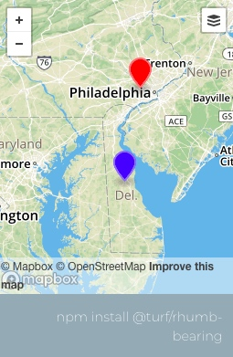
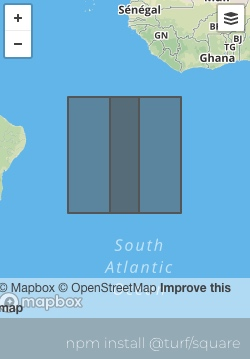
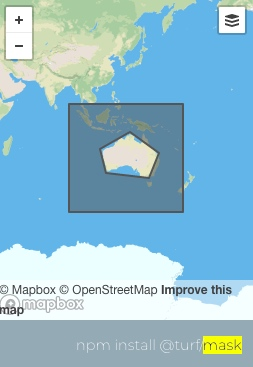
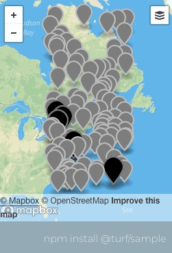

# measurement
## alone
###含义：
Takes a LineString and returns a Point at a specified distance along the line.
输入一条线，返回在这条线上指定位置的点。

### 图片：
 

### 链接：
[点击详情](http://turfjs.org/docs#along)

## area
### 含义：
Takes one or more features and returns their area in square meters.
 取一个或多个 features 并返回以平方米为单位的面积
### 图片

### 链接
[点击详情](http://turfjs.org/docs#area)

## bbox
### 含义：
Takes a set of features, calculates the bbox of all input features, and returns a bounding box.
 以一组特征，计算所有输入特征的bbox，并返回一个边界框。
### 图片

### 链接
[点击详情](http://turfjs.org/docs#area)
## bboxPolygon
### 含义
Takes a bbox and returns an equivalent polygon.
取一个bbox并返回一个相等的 polygon。
### 图片

### 链接
[点击详情](http://turfjs.org/docs/#bboxPolygon)

## bearing
### 含义
Takes two points and finds the geographic bearing between them, i.e. the angle measured in degrees from the north line (0 degrees)
取两点并找出它们之间的地理方位关系，即从北线（0度）测量的角度（以度为单位）
### 图片

### 链接
[点击详情](http://turfjs.org/docs/#bearing)
## center
### 含义
Takes a Feature or FeatureCollection and returns the absolute center point of all features.
取一个 Feature 或者 FeatureCollection 返回 所有的features 相对中心的点
### 图片

### 谅解
[点击详情](http://turfjs.org/docs/#center)
## centerOfMass
### 含义
Takes any Feature or a FeatureCollection and returns its center of mass using this formula: Centroid of Polygon.
取随便哪一个 Feature 或者 FeatureCollection 返回组成多边形的质心.
### 图片

### 链接
[点击更多](http://turfjs.org/docs/#centerOfMass)
## centroid
### 含义
Takes one or more features and calculates the centroid using the mean of all vertices. This lessens the effect of small islands and artifacts when calculating the centroid of a set of polygons.
获取一个或多个 features，并且用所有顶点的平均值计算质心；
这在计算一组多边形的质心时减弱了小岛和伪影的影响
### 图片

### 链接
[点击详情](http://turfjs.org/docs/#centroid)
## destination
### 含义
Takes a Point and calculates the location of a destination point given a distance in degrees, radians, miles, or kilometers; and bearing in degrees. This uses the Haversine formula to account for global curvature.
去一个点并且计算以度，弧度，英里或者公里为单位的距离的目的地的点的位置。使用 Haversine 公式来说明全局曲率。
### 图片

### 链接
[点击详情](http://turfjs.org/docs/#destination)
## distance
### 含义
Calculates the distance between two points in degrees, radians, miles, or kilometers. This uses the Haversine formula to account for global curvature.
以两个点的角度，弧度，英里，公里，来计算距离，使用 Haversine 公式来说明全局曲率。
### 图片

### 链接
[点击详情](http://turfjs.org/docs/#distance)
## envelope
### 含义
Takes any number of features and returns a rectangular Polygon that encompasses all vertices.
取任意数量的 features 并且返回一个包括所有点的多边形的 Polygon.
### 图片

### 链接
[点击详情](http://turfjs.org/docs/#envelope)
## length
### 含义
Takes a GeoJSON and measures its length in the specified units, (Multi)Point 's distance are ignored.
取一个 GeoJSON 并且以指定的单位测量他的长度，（多个）点的距离被忽略
### 图片

### 链接
[点击详情](http://turfjs.org/docs/#length)
## midpoint
### 含义
Takes two points and returns a point midway between them. The midpoint is calculated geodesically, meaning the curvature of the earth is taken into account.
取两个点并且返回一个他们中间的点，中点是以测地方式计算的，这意味着地球的曲率被考虑在内。
### 图片

### 链接
[点击详情](http://turfjs.org/docs/#midpoint)
## pointOnFeature
### 含义
Takes a Feature or FeatureCollection and returns a Point guaranteed to be on the surface of the feature.
取一个 Feature 或者 FeatureCollection并且返回一个保证位于该表面上的Point。
### 图片

### 链接
[点击详情](http://turfjs.org/docs/#pointOnFeature)
## polygonTangents
### 含义
Finds the tangents of a (Multi)Polygon from a Point.
从一个点查找一个多边形的切线
### 图片

### 链接
[点击详情](http://turfjs.org/docs/#polygonTangents)
## pointToLineDistance
### 含义
Returns the minimum distance between a Point and a LineString , being the distance from a line the minimum distance between the point and any segment of the LineString.
返回一个点到线的距离，是线与点之间的最小距离和LineString的任何段的距离。
### 图片
暂无
### 链接
[点击详情](http://turfjs.org/docs/#pointToLineDistance)
## rhumbBearing
### 含义
Takes two points and finds the bearing angle between them along a Rhumb line i.e. the angle measured in degrees start the north line (0 degrees)

取两个点并且沿着 Rhumb 线找到他们之间的方位角，即北方向（0度）开始测量的角度。
### 图片

### 链接
[点击详情](http://turfjs.org/docs/#rhumbBearing)
## rhumbDestination
### 含义
Returns the destination Point having travelled the given distance along a Rhumb line from the origin Point with the (varant) given bearing.

返回已经沿着从原点指向的Rhumb线以给定方位行进给定距离的目标点。

### 图片

### 链接
[点击详情](http://turfjs.org/docs/#rhumbDestination)

## rhumbDistance
### 含义
Calculates the distance along a rhumb line between two points in degrees, radians, miles, or kilometers.
以两个点的角度，弧度，英里或者公里测量两个点之间一条线上的距离。
### 图片

### 链接
[点击详情](http://turfjs.org/docs/#rhumbDistance)
## square
### 含义
Takes a bounding box and calculates the minimum square bounding box that would contain the input.
采用边界框并计算包含输入的最小平方边界框。
### 图片

### 链接
[点击详情](http://turfjs.org/docs/#square)
## greatCircle
### 含义
Calculate great circles routes as LineString
计算大圆圈路线作为LineString
### 图片

### 链接
[点击详情](http://turfjs.org/docs/#greatCircle)
# coordinate mutation
## cleanCoords
### 含义
Removes redundant coordinates from any GeoJSON Geometry.
从任意一个 GeoJSON Geometry 中移除多余的点
### 图片 
暂无
### 链接
[点击详情](http://turfjs.org/docs/#cleanCoords)
## flip
### 含义
Takes input features and flips all of their coordinates from [x, y] to [y, x].
取输入的 features 并且将他们的点从[x,y]翻转到[y,x]
### 图片 

暂无
### 链接
[点击详情](http://turfjs.org/docs/#flip)
## rewind
### 含义
Rewind (Multi)LineString or (Multi)Polygon outer ring counterclockwise and inner rings clockwise (Uses Shoelace Formula ).
旋转 LineString 或者 Polygon 外圈顺时针，内圈逆时针。
### 图片

### 链接
[点击详情](http://turfjs.org/docs/#rewind)
## round
### 含义
精确圆的经度
### 图片
暂无
### 链接
[点击详情](http://turfjs.org/docs/#round)
## truncate
# transormation
## bboxClip
### 含义
Takes a Feature and a bbox and clips the feature to the bbox using lineclip. May result in degenerate edges when clipping Polygons.
取一个 Feature 和 一个 bbox 并且 用 lineclip 剪辑 feature 到 bbox。剪切多边形时可能会导致退化边缘。

### 图片

### 链接
[点击详情](http://turfjs.org/docs/#bboxClip)
## bezierSpline
### 含义
Takes a line and returns a curved version by applying a Bezier spline algorithm.
取一条线并通过应用贝塞尔样条线算法返回一个曲线版本。

### 图片

### 链接
[点击详情](http://turfjs.org/docs/#bezierSpline)

## buffer
### 含义
Calculates a buffer for input features for a given radius. Units supported are miles, kilometers, and degrees.
计算给定半径的输入要素的缓冲区。支持的单位是英里，公里和度数。
### 图片

### 链接
[点击详情](http://turfjs.org/docs/#buffer)

## buffer
### 含义
Takes a Point and calculates the circle polygon given a radius in degrees, radians, miles, or kilometers; and steps for precision.
获取一个点并计算以度，弧度，英里或公里为半径的圆多边形;并提供精确的步骤。
### 图片

### 链接
[点击详情](http://turfjs.org/docs/#buffer)
## circle
### 含义
Takes a Point and calculates the circle polygon given a radius in degrees, radians, miles, or kilometers; and steps for precision.
获取一个点并计算以度，弧度，英里或公里为半径的圆多边形;并提供精确的步骤。
### 图片

### 链接
[点击详情](http://turfjs.org/docs/#circle)
## clone
### 含义
Returns a cloned copy of the passed GeoJSON Object, including possible 'Foreign Members'. ~3-5x faster than the common JSON.parse + JSON.stringify combo method.
返回传递的GeoJSON对象的复制副本，包括可能的“外部成员”。比普通的JSON.parse + JSON.stringify组合方法快3-5倍。
### 图片
暂无
### 链接
http://turfjs.org/docs/#clone
## concave
### 含义
Takes a set of points and returns a concave hull Polygon or MultiPolygon. Internally, this uses turf-tin to generate geometries.
取一组点并返回一个凹面Polygon或MultiPolygon。在内部，这使用草皮锡来生成几何图形。

### 图片

### 链接
http://turfjs.org/docs/#concave
## convex 
### 含义
Takes a Feature or a FeatureCollection and returns a convex hull Polygon.
取一个Feature或一个FeatureCollection并返回一个凸包多边形。
### 图片

### 链接
http://turfjs.org/docs/#convex
## difference
### 含义
Finds the difference between two polygons by clipping the second polygon from the first.
通过从第一个多边形裁剪第二个多边形来查找两个多边形之间的区别。

### 图片

### 链接
http://turfjs.org/docs/#difference
## dissolve
### 含义
Dissolves a FeatureCollection of polygon features, filtered by an optional property name:value. Note that mulitpolygon features within the collection are not supported.
溶解面要素的FeatureCollection，并通过可选的属性名称：value进行过滤。请注意，集合中的多个多边形要素不受支持。
### 图片

### 链接
http://turfjs.org/docs/#dissolve
## intersect
### 含义
Takes two polygons and finds their intersection. If they share a border, returns the border; if they don't intersect, returns undefined.
取两个多边形并找到它们的交集。如果它们共享边界，则返回边界；如果它们不相交，则返回未定义的边界。
### 图片

### 链接
http://turfjs.org/docs/#intersect
## lineOffset
### 含义

Takes a line and returns a line at offset by the specified distance.
取一条线并返回以指定的距离偏移的另一条线。
### 图片

### 链接
http://turfjs.org/docs/#lineOffset
## simplify
### 含义
Takes a GeoJSON object and returns a simplified version. Internally uses simplify-js to perform simplification using the Ramer-Douglas-Peucker algorithm.
获取一个GeoJSON对象并返回一个简化版本。使用Ramer-Douglas-Peucker算法在内部使用simplify-js来执行简化。
### 图片

### 链接
http://turfjs.org/docs/#simplify

## tesselate
### 含义
Tesselates a Feature into a FeatureCollection of triangles using earcut.
### 图片

### 链接
http://turfjs.org/docs/#tesselate
## transformRotate
### 含义
Rotates any geojson Feature or Geometry of a specified angle, around its centroid or a given pivot point; all rotations follow the right-hand rule: https://en.wikipedia.org/wiki/Right-hand_rule
在其质心或给定的轴心点周围旋转指定角度的任何geojson Feature或Geometry;所有旋转都遵循右手法则：https：//en.wikipedia.org/wiki/Right-hand_rule

### 图片

### 链接
http://turfjs.org/docs/#transformRotate
## transformTranslate
### 含义
Moves any geojson Feature or Geometry of a specified distance along a Rhumb Line on the provided direction angle.
在提供的方向角上沿着Rhumb线移动指定距离的任何geojson要素或几何图形。
### 图片

### 链接
http://turfjs.org/docs/#transformTranslate
## transformScale
从给定点缩放一个GeoJSON的缩放因子（例如：factor = 2会使GeoJSON增大200％）。如果提供FeatureCollection，则将根据每个特征计算原点。
### 图片

### 链接
http://turfjs.org/docs/#transformScale
## union
### 含义
Takes two or more polygons and returns a combined polygon. If the input polygons are not contiguous, this function returns a MultiPolygon feature.
取两个或更多个多边形并返回一个组合多边形。如果输入多边形不连续，则此函数返回MultiPolygon特征。
### 图片

### 链接
http://turfjs.org/docs/#union
## voronoi
### 含义
Takes a FeatureCollection of points, and a bounding box, and returns a FeatureCollection of Voronoi polygons.
获取点的FeatureCollection和边界框，并返回Voronoi多边形的FeatureCollection。
### 图片

### 链接
http://turfjs.org/docs/#voronoi
## combine
### 含义
Combines a FeatureCollection of Point , LineString , or Polygon features into MultiPoint , MultiLineString , or MultiPolygon features.
将Point，LineString或Polygon特征的FeatureCollection组合到MultiPoint，MultiLineString或MultiPolygon特征中。
### 图片

## explode
### 含义
Takes a feature or set of features and returns all positions as points.
使用一个或一组功能并将所有位置返回为点。
### 图片

### 链接
http://turfjs.org/docs/#explode
## flatten
### 含义
Flattens any GeoJSON to a FeatureCollection inspired by geojson-flatten.

将任何GeoJSON平铺为由geojson-flatten启发的FeatureCollection。
### 图片

### 链接
http://turfjs.org/docs/#flatten
## lineToPolygon
### 含义
Converts (Multi)LineString(s) to Polygon(s).
将（多）LineString（s）转换为多边形。
### 图片

### 链接
http://turfjs.org/docs/#lineToPolygon
## lineSplit
### 含义
Split a LineString by another GeoJSON Feature.
通过另一个GeoJSON功能拆分LineString。
### 图片

### 链接
http://turfjs.org/docs/#lineSplit
## mask
### 含义
Takes any type of polygon and an optional mask and returns a polygon exterior ring with holes.
采取任何类型的多边形和一个可选的蒙版，并返回一个带孔的多边形外环。
### 图片

### 链接
http://turfjs.org/docs/#mask
## nearestPointOnLine
### 含义
Takes a Point and a LineString and calculates the closest Point on the (Multi)LineString.
取一个点和一个LineString并计算（多）LineString上最接近的点。
### 图片

### 链接
http://turfjs.org/docs/#nearestPointOnLine
## sector
### 含义
Creates a circular sector of a circle of given radius and center Point , between (clockwise) bearing1 and bearing2; 0 bearing is North of center point, positive clockwise.

在（顺时针）轴承1和轴承2之间创建给定半径和中心点的圆形扇形; 0轴承是中心点的北部，顺时针方向为正。
### 图片

### 链接
http://turfjs.org/docs/#sector
## shortestPath
### 含义
Returns the shortest path from start to end without colliding with any Feature in obstacles
返回从开始到结束的最短路径，而不与障碍物中的任何特征相碰撞
### 图片

### 链接
http://turfjs.org/docs/#shortestPath
## unkinkPolygon
### 含义
Takes a kinked polygon and returns a feature collection of polygons that have no kinks. Uses simplepolygon internally.
取一个扭曲的多边形并返回一个没有扭结的多边形特征集合。内部使用simplepolygon。

### 图片

### 链接
http://turfjs.org/docs/#unkinkPolygon

## featureCollection
### 含义
Takes one or more Features and creates a FeatureCollection.
取一个或者多个 Features 并且返回一个FeatureCollection
### 图片
暂无
### 链接
http://turfjs.org/docs/#featureCollection
## feature
### 含义
Wraps a GeoJSON Geometry in a GeoJSON Feature.
在 GeoJSON Feature 中包装 GeoJSON Geometry。
### 图片
暂无
### 链接
http://turfjs.org/docs/#feature
## geometryCollection
### 含义
Creates a Feature based on a coordinate array. Properties can be added optionally.

基于一个坐标的数组创建一个 Feature，属性可以随意添加。
### 图片
暂无
### 链接
http://turfjs.org/docs/#geometryCollection
## lineString
### 含义
Creates a LineString Feature from an Array of Positions.
根据一个位置的数组创建一个 LineString Feature。
### 图片
暂无
### 链接
http://turfjs.org/docs/#lineString
## multiLineString
### 含义
Creates a Feature based on a coordinate array. Properties can be added optionally.

基于一个坐标的数组创建一个 Feature，属性可以随意添加。
### 图片
暂无
### 链接
http://turfjs.org/docs/#multiLineString
## multiPoint
### 含义
Creates a Feature based on a coordinate array. Properties can be added optionally.

基于一个坐标的数组创建一个 Feature，属性可以随意添加。
### 图片
暂无
### 链接
http://turfjs.org/docs/#multiPoint
## multiPolygon
### 含义
Creates a Feature based on a coordinate array. Properties can be added optionally.

基于一个坐标的数组创建一个 Feature，属性可以随意添加。
### 图片
暂无
### 链接
http://turfjs.org/docs/#multiPoint
## point
### 含义
Creates a Point Feature from a Position.
根据位置信息创建一个点
### 链接
http://turfjs.org/docs/#point
## polygon
### 含义
Creates a Polygon Feature from an Array of LinearRings.

根据一个 LinearRings 数组床架一个 Polygon Feature。
### 链接
http://turfjs.org/docs/#polygon

# random
## randomPosition
### 含义 
Returns a random position within a box.
选择一个框中的随机的位置
### 链接
http://turfjs.org/docs/#randomPosition
## randomPoint
### 含义
Returns a random point.
含义一个随机的点
### 链接
http://turfjs.org/docs/#randomPoint
## randomLineString
### 含义
Returns a random linestring.

返回一个 随机的 linestring
### 链接
http ://turfjs.org/docs/#randomLineString
## planepoint
### 含义
Takes a triangular plane as a Polygon and a Point within that triangle and returns the z-value at that point. The Polygon should have properties a , b , and c that define the values at its three corners. Alternatively, the z-values of each triangle point can be provided by their respective 3rd coordinate if their values are not provided as properties.
将三角形平面视为多边形和该三角形内的一个点，并返回该点处的z值。多边形应该具有属性a，b和c，以定义其三个角的值。或者，如果它们的值不作为属性提供，则每个三角形点的z值可以由它们各自的第三坐标提供。

###  图片

### 链接
http://turfjs.org/docs/#planepoint
## randomLineString
### 含义
Returns a random linestring.
返回一个随机的 linestring
### 链接
## randomPolygon
### 含义
Returns a random polygon.
返回一个随机的 polygon.
### 链接
http://turfjs.org/docs/#randomPolygon
## randomPoint
### 含义
Returns a random point.
返回一个随机的点
### 链接
http://turfjs.org/docs/#randomPoint
## randomLineString
### 含义
Returns a random linestring.
返回一个随机的 linestring.
## randomPolygon
### 含义
Returns a random polygon.
返回一个随机的 polygon.
### 链接
http://turfjs.org/docs/#randomPolygon
# DATA
## sample
### 含义
Takes a FeatureCollection and returns a FeatureCollection with given number of features at random.
取一个 FeatureCollection 并且随机返回给定数量的特征的 FeatureCollection
### 图片

### 链接
http://turfjs.org/docs/#sample
# INTERPOLATION
## interpolate
### 含义
Takes a set of points and estimates their 'property' values on a grid using the Inverse Distance Weighting (IDW) method.
取一组点并且使用反距离加权（IDW）方法在网格上估计其“属性”值。
### 图片

### 链接
http://turfjs.org/docs/#interpolate
## isobands
### 含义
Takes a grid FeatureCollection of Point features with z-values and an array of value breaks and generates filled contour isobands.

将具有z值的点要素的网格FeatureCollection和一组值填充为等值线并生成填充等值线。
### 图片
暂无
### 链接
http://turfjs.org/docs/#isobands
## isolines 
### 含义
Takes a grid FeatureCollection of Point features with z-values and an array of value breaks and generates isolines.
将具有z值的点要素的网格FeatureCollection和一组值替换为等值线并生成等值线。
### 图片

### 链接
http://turfjs.org/docs/#isolines
## planepoint
### 含义
Takes a triangular plane as a Polygon and a Point within that triangle and returns the z-value at that point. The Polygon should have properties a , b , and c that define the values at its three corners. Alternatively, the z-values of each triangle point can be provided by their respective 3rd coordinate if their values are not provided as properties.
将三角形平面视为多边形和该三角形内的一个点，并返回该点处的z值。多边形应该具有属性a，b和c，以定义其三个角的值。或者，如果它们的值不作为属性提供，则每个三角形点的z值可以由它们各自的第三坐标提供。
### 图片

### 链接
http://turfjs.org/docs/#planepoint
## tin
### 含义
Takes a set of points and creates a Triangulated Irregular Network , or a TIN for short, returned as a collection of Polygons. These are often used for developing elevation contour maps or stepped heat visualizations.

取一组点并创建一个不规则三角网，或者简称为TIN，作为多边形集合返回。这些通常用于开发高程等高线图或阶梯式热可视化。
# JOINS
## pointsWithinPolygon
### 含义
Finds Points that fall within (Multi)Polygon(s).
查找术语多边形内的点

### 图片

### 链接
http://turfjs.org/docs/#pointsWithinPolygon
## tag
### 含义
Takes a set of points and a set of polygons and performs a spatial join.

取一组点和一组 polygons 并且进行空间链接
### 图片

### 链接
http://turfjs.org/docs/#tag
# GRIDS
## hexGrid
### 含义
Takes a bounding box and the diameter of the cell and returns a FeatureCollection of flat-topped hexagons or triangles ( Polygon features) aligned in an "odd-q" vertical grid as described in Hexagonal Grids.
获取边界框和单元格的直径，并返回平顶六边形或三角形（多边形要素）的FeatureCollection，该对象位于“奇数q”垂直网格中，如六边形网格中所述。
### 图片

### 链接
http://turfjs.org/docs/#hexGrid
## pointGrid
### 含义
Creates a Point grid from a bounding box, FeatureCollection or Feature.
从边界框FeatureCollection或Feature创建点网格。
### 图片

### 链接
http://turfjs.org/docs/#pointGrid
## squareGrid
### 含义
Creates a square grid from a bounding box, Feature or FeatureCollection.
根据边界框，Feature或FeatureCollection创建一个正方形网格。
### 图片

### 链接
http://turfjs.org/docs/#squareGrid
## triangleGrid
### 含义
Takes a bounding box and a cell depth and returns a set of triangular polygons in a grid.

获取一个包围盒和单元格深度，并在网格中返回一组三角形多边形。
### 图片

### 链接
http://turfjs.org/docs/#triangleGrid
# CLASSIFICATION
## nearestPoint
### 含义
Takes a reference point and a FeatureCollection of Features with Point geometries and returns the point from the FeatureCollection closest to the reference. This calculation is geodesic.

作为一个参考点和featurecollection特征点的几何形状和返回点从最接近的参考featurecollection。这个计算是测地线的。

###图片

### 链接
http://turfjs.org/docs/#nearestPoint
# AGGREGATION
## collect
### 含义
将点合并成指定属性到 polygons 中。给定点的 inProperty 和 polygons 的 outProperty，它会找到每个多边形内的每个点，从这些点收集inProperty值，并将它们作为一个数组添加到多边形上的outProperty。
### 图片

### 链接
http://turfjs.org/docs/#collect
## clustersDbscan
### 含义
Takes a set of points and partition them into clusters according to https://en.wikipedia.org/wiki/DBSCAN data clustering algorithm.

根据https://en.wikipedia.org/wiki/DBSCAN数据聚类算法获取一组点并将它们分成群集。
### 图片

### 链接
http://turfjs.org/docs/#clustersDbscan
## clustersKmeans
### 含义
Takes a set of points and partition them into clusters using the k-mean. It uses the k-means algorithm

采用一组点并使用 k-mean 将它们分开。它使用k-means算法
### 图片

### 链接
http://turfjs.org/docs/#clustersKmeans
# META 
## coordAll
### 含义
Get all coordinates from any GeoJSON object.
从任意一个 GeoJSON 中获取所有的点。
### 图片 
暂无
### 链接
http://turfjs.org/docs/#coordAll
## coordEach 
### 含义
Iterate over coordinates in any GeoJSON object, similar to Array.forEach()

遍历任何GeoJSON对象坐标，类似于Array.forEach()
### 图片
暂无
### 链接
http://turfjs.org/docs/#coordEach
## coordReduce
### 含义
Reduce coordinates in any GeoJSON object, similar to Array.reduce()

减少任何GeoJSON对象中的坐标，类似于Array.reduce（）
### 图片
暂无
### 链接
http://turfjs.org/docs/#coordReduce
## featureEach
### 含义
Iterate over features in any GeoJSON object, similar to Array.forEach.

迭代任何GeoJSON对象中的特征，类似于Array.forEach。

### 图片
暂无
### 链接
http://turfjs.org/docs/#featureEach
## featureReduce
### 含义
Reduce features in any GeoJSON object, similar to Array.reduce().

减少任何GeoJSON对象中的特征，类似于Array.reduce（）。
### 图片
暂无
### 链接
http://turfjs.org/docs/#featureReduce
## flattenEach
### 含义
Iterate over flattened features in any GeoJSON object, similar to Array.forEach.

## flattenReduce
### 含义
Reduce flattened features in any GeoJSON object, similar to Array.reduce().

减少任何GeoJSON对象中的扁平化特征，类似于Array.reduce（）。
### 图片
暂无
### 链接
http://turfjs.org/docs/#flattenReduce
## getCoord
### 含义
Unwrap a coordinate from a Point Feature, Geometry or a single coordinate.

从点要素，几何或单个坐标解包一个坐标。
### 图片
暂无
### 链接
http://turfjs.org/docs/#getCoord
## getCoords
### 含义
Unwrap coordinates from a Feature, Geometry Object or an Array

从特征，几何对象或阵列展开坐标
### 图片
暂无
### 链接
http://turfjs.org/docs/#getCoords
## getGeom
### 含义
Get Geometry from Feature or Geometry Object
从 Feature 或 Geometry 对象获取 Geometry
### 图片
暂无
### 链接
http://turfjs.org/docs/#getGeom
## getType
### 含义
Get GeoJSON object's type, Geometry type is prioritize.

获取GeoJSON对象的类型，Geometry 类型是优先。
### 图片
暂无
### 链接
http://turfjs.org/docs/#getType
## geomEach
### 含义
Iterate over each geometry in any GeoJSON object, similar to Array.forEach()

迭代任何GeoJSON对象中的每个几何体，类似于Array.forEach（）

### 图片
暂无
### 链接
http://turfjs.org/docs/#geomEach
## getType
### 含义
Get GeoJSON object's type, Geometry type is prioritize.

获取GeoJSON对象的类型，几何类型是优先。

### 图片
暂无
### 链接
http://turfjs.org/docs/#getType
## geomEach
### 含义

Iterate over each geometry in any GeoJSON object, similar to Array.forEach()

迭代任何GeoJSON对象中的每个几何体，类似于Array.forEach（）
### 图片
暂无
### 链接
http://turfjs.org/docs/#geomEach
## geomReduce
### 含义
减少任何GeoJSON对象中的几何体，类似于Array.reduce（）。
### 图片
暂无
### 链接
http://turfjs.org/docs/#geomReduce
## segmentEach
### 含义
Iterate over 2-vertex line segment in any GeoJSON object, similar to Array.forEach() (Multi)Point geometries do not contain segments therefore they are ignored during this operation.
Iterate over 2-vertex line segment in any GeoJSON object, similar to Array.forEach() (Multi)Point geometries do not contain segments therefore they are ignored during this operation.    
遍历任何GeoJSON对象2-线段，类似于数组。foreach()（多）点的几何形状，因此它们不包含该操作中忽略段。

### 图片
暂无
### 链接
## segmentReduce
### 含义
Reduce 2-vertex line segment in any GeoJSON object, similar to Array.reduce() (Multi)Point geometries do not contain segments therefore they are ignored during this operation.

减少任何GeoJSON对象中的2顶点线段，类似于Array.reduce（）（多点）点几何不包含分段，因此在此操作期间将忽略它们。

### 链接
http://turfjs.org/docs/#segmentReduce
## getCluster
### 含义
Get Cluster
获取 Cluster
### 链接
http://turfjs.org/docs/#getCluster
## clusterEach
### 含义
clusterEach
### 链接
http://turfjs.org/docs/#clusterEach
## clusterReduce
### 含义
Reduce clusters in GeoJSON Features, similar to Array.reduce()

减少GeoJSON功能中的簇，类似于Array.reduce（）
### 链接
http://turfjs.org/docs/#clusterReduce
# ASSERTIONS
## collectionOf
### 含义
Enforce expectations about types of FeatureCollection inputs for Turf. Internally this uses geojsonType to judge geometry types.

强化对Turf的FeatureCollection输入类型的期望。在内部，它使用geojsonType来判断几何类型。
### 链接
http://turfjs.org/docs/#collectionOf
## containsNumber
### 含义
Checks if coordinates contains a number
检查坐标是否包含数字
### 链接
http://turfjs.org/docs/#containsNumber
## geojsonType
### 含义
Enforce expectations about types of GeoJSON objects for Turf.
强化对Turf的GeoJSON对象类型的期望。
### 链接
http://turfjs.org/docs/#geojsonType
## featureOf
### 含义
Enforce expectations about types of Feature inputs for Turf. Internally this uses geojsonType to judge geometry types.
强化对 Turf 特征输入类型的期望。在内部，它使用geojsonType来判断几何类型。

### 链接
http://turfjs.org/docs/#featureOf
# BOOLEANS
## booleanClockwise
### 含义
Takes a ring and return true or false whether or not the ring is clockwise or counter-clockwise.
去一个 ring 并且返回 true 或者 false 不管这个 ring 是顺时针还是逆时针。
### 链接
http://turfjs.org/docs/#booleanClockwise
## booleanContains
### 含义
Boolean-contains returns True if the second geometry is completely contained by the first geometry. The interiors of both geometries must intersect and, the interior and boundary of the secondary (geometry b) must not intersect the exterior of the primary (geometry a). Boolean-contains returns the exact opposite result of the @turf/boolean-within.
如果第二个几何体完全由第一个几何体包含，则返回True。两种几何形状的内部必须相交，并且次级（几何b）的内部和边界不得与主（几何a）的外部相交。 Boolean-contains返回与@ turf / boolean-within完全相反的结果。

### 链接
http://turfjs.org/docs/#booleanContains
## booleanCrosses
### 含义
Boolean-Crosses returns True if the intersection results in a geometry whose dimension is one less than the maximum dimension of the two source geometries and the intersection set is interior to both source geometries.
如果交集导致几何的维数小于两个源几何的最大维数，并且交集对于两个源几何都是内部的，则布尔十字返回True。

### 链接
http://turfjs.org/docs/#booleanCrosses
## booleanDisjoint
### 含义
Boolean-disjoint returns (TRUE) if the intersection of the two geometries is an empty set.
如果两个几何的交集是空集合，则布尔不相交返回（TRUE）。
### 链接
http://turfjs.org/docs/#booleanDisjoint
## booleanEqual
### 含义
Determine whether two geometries of the same type have identical X,Y coordinate values. See http://edndoc.esri.com/arcsde/9.0/general_topics/understand_spatial_relations.htm

确定两个相同类型的几何图形是否具有相同的X，Y坐标值。请参阅http://edndoc.esri.com/arcsde/9.0/general_topics/understand_spatial_relations.htm
### 链接 
http://turfjs.org/docs/#booleanEqual
## booleanOverlap
### 含义
Compares two geometries of the same dimension and returns true if their intersection set results in a geometry different from both but of the same dimension. It applies to Polygon/Polygon, LineString/LineString, Multipoint/Multipoint, MultiLineString/MultiLineString and MultiPolygon/MultiPolygon.
比较同一维的两个几何，如果它们的交集产生的几何不同于两者，但是具有相同的维，则返回true。它适用于多边形/多边形，LineString / LineString，多点/多点，MultiLineString / MultiLineString和MultiPolygon / MultiPolygon。
### 链接
http://turfjs.org/docs/#booleanOverlap
## booleanParallel
### 含义
Boolean-Parallel returns True if each segment of line1 is parallel to the correspondent segment of line2

如果line1的每个段都与line2的对应段并行，则Boolean-Parallel返回True
### 链接
http://turfjs.org/docs/#booleanParallel
## booleanPointInPolygon
### 含义
Takes a Point and a Polygon or MultiPolygon and determines if the point resides inside the polygon. The polygon can be convex or concave. The function accounts for holes.
取一个点和一个Polygon或MultiPolygon，并确定该点是否位于多边形内。多边形可以是凸面或凹面。该功能占孔。
### 链接
http://turfjs.org/docs/#booleanPointInPolygon
## booleanPointOnLine
### 含义
Returns true if a point is on a line. Accepts a optional parameter to ignore the start and end vertices of the linestring.
如果一个点在一个 line 上，则返回true。接受可选参数以忽略 linestring 的开始和结束顶点。
### 链接
http://turfjs.org/docs/#booleanPointOnLine
## booleanWithin
### 含义
Boolean-within returns true if the first geometry is completely within the second geometry. The interiors of both geometries must intersect and, the interior and boundary of the primary (geometry a) must not intersect the exterior of the secondary (geometry b). Boolean-within returns the exact opposite result of the @turf/boolean-contains.
如果第一个几何图形完全位于第二个几何图形内，则Boolean-within返回true。两种几何形状的内部必须相交，并且主要（几何a）的内部和边界不得与次要（几何b）的外部相交。 Boolean-within返回与@turf/boolean-contains完全相反的结果。
### 链接
http://turfjs.org/docs/#booleanWithin
# UNIT CONVERSION
## bearingToAzimuth
### 含义
Converts any bearing angle from the north line direction (positive clockwise) and returns an angle between 0-360 degrees (positive clockwise), 0 being the north line

从北线方向（顺时针旋转）转换任何方位角，并返回0-360度（顺时针旋转）的角度，0为北线
### 链接
http://turfjs.org/docs/#bearingToAzimuth
## convertArea
### 含义
Converts a area to the requested unit. Valid units: kilometers, kilometres, meters, metres, centimetres, millimeters, acres, miles, yards, feet, inches
将区域转换为请求的单元。有效单位：公里，公里，米，米，厘米，毫米，英亩，英里，码，英尺

### 链接
http://turfjs.org/docs/#convertArea
## convertLength
### 含义
Converts a length to the requested unit. Valid units: miles, nauticalmiles, inches, yards, meters, metres, kilometers, centimeters, feet.
将长度转换为请求的单位。有效单位：英里，航海里程，英寸，码，米，米，公里，厘米，英尺

### 链接
http://turfjs.org/docs/#convertLength
## degreesToRadians
### 含义
Converts an angle in degrees to radians
将角度转换为弧度
### 链接
http://turfjs.org/docs/#degreesToRadians
## lengthToDegrees
### 含义
Convert a distance measurement (assuming a spherical Earth) from a real-world unit into degrees Valid units: miles, nauticalmiles, inches, yards, meters, metres, centimeters, kilometres, feet
将距离测量值（假设球形地球）从实际单位转换为度数有效单位：英里，海里英里，英寸，码，米，米，厘米，公里，英尺
### 链接
http://turfjs.org/docs/#lengthToDegrees
## radiansToLength
### 含义
Convert a distance measurement (assuming a spherical Earth) from radians to a more friendly unit. Valid units: miles, nauticalmiles, inches, yards, meters, metres, kilometers, centimeters, feet
将距离测量（假设球形地球）从弧度转换为更友好的单位。有效单位：英里，航海里程，英寸，码，米，米，公里，厘米，英尺
### 链接
http://turfjs.org/docs/#radiansToLength
## radiansToDegrees
含义
Converts an angle in radians to degrees

将弧度的角度转换为度数
### 链接
http://turfjs.org/docs/#radiansToDegrees
## toMercator
### 含义
将WGS84 GeoJSON对象转换为墨卡托（EPSG：900913）投影

### 链接
http://turfjs.org/docs/#toMercator
## toWgs84
### 含义
Converts a Mercator (EPSG:900913) GeoJSON object into WGS84 projection

将墨卡托（EPSG：900913）GeoJSON对象转换为WGS84投影

### 链接
Converts a Mercator (EPSG:900913) GeoJSON object into WGS84 projection

将WGS84 GeoJSON对象为墨卡托投影（例如：900913）

